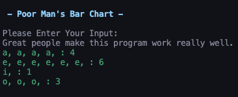

# Practice Python Projects
I am doing practice projects from the Impractical Python Projects book from No Starch Press, by Lee Vaughan. These are my attempts at problems and challenges.

# Installation and Running
If you find yourself wanting to try any of these programs, simply running them as a basic python file works.

```python name.py```

> Usually, `python` or `python3` will work as the command for the terminal input shown above; however, this can differ per machine and OS

Obviously, replacing name.py with whichever file in this repository you want to run, I will include a name section or line in each challenge or project so you can see what file to replace name.py with.

## Project 1 Random Name Generator
In this project we use 2 tuples to randomly generate a first and last name for someone. I am using this to make NPC names, for a videogame, or D&D or perhaps another role playing game where NPC's are needed.

#### Name 
`project1.py`

- ### Project 1 Challenge: Poor Man's Bar Chart

    I created a small version of the bar chart, which just shows how many of each vowel were used in a given 1 line input. It also prints the numerical value of how many, rather than just showing the list of each one.
    
    Example Output: 

    

    I used the pylint and pydocstyle CLI's to rate my code on following guidelines, for practicing structured and organized code.

    Additionally, I used the termcolor library to color and style terminal text.

    #### Name
    `challenge1.py`
    

